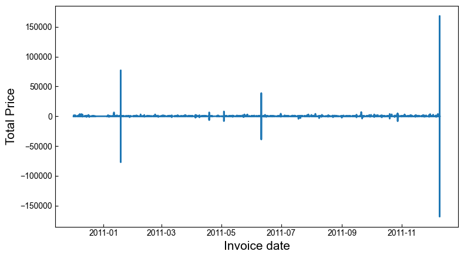
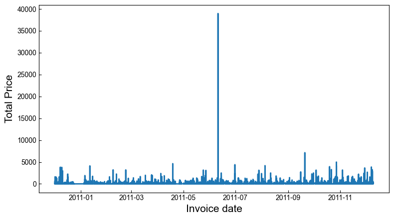
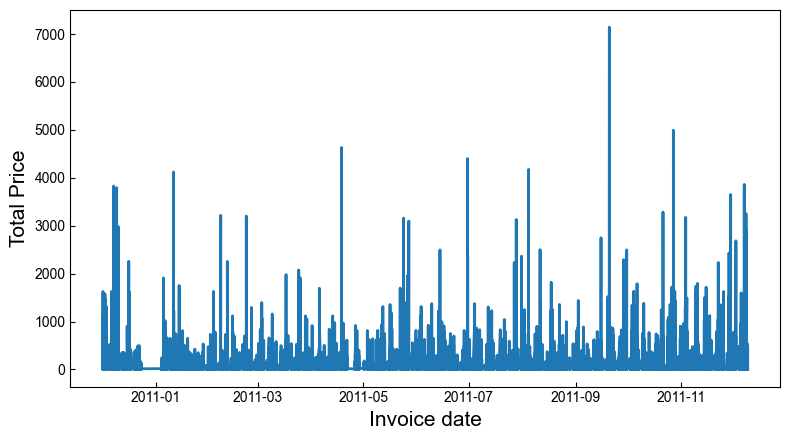

# UCI Online Retail Datasetを用いたアソシエーション分析


```python
import warnings
warnings.filterwarnings('ignore')
```


```python
import pandas as pd
import matplotlib.pyplot as plt

from mlxtend.frequent_patterns import apriori
from mlxtend.frequent_patterns import association_rules

import networkx as nx
```


```python
plt.rcParams['xtick.direction'] = 'in'
plt.rcParams['ytick.direction'] = 'in'
plt.rcParams['xtick.minor.visible'] = False
plt.rcParams['ytick.minor.visible'] = False
plt.rcParams['font.family'] = 'Arial'
```


```python
saved_dir = '../Results/'
random_seed = 314
```


```python
_df = pd.read_excel('../Data/Online Retail.xlsx')
_df.head()
```


<div>
<table border="1" class="dataframe">
  <thead>
    <tr style="text-align: right;">
      <th></th>
      <th>InvoiceNo</th>
      <th>StockCode</th>
      <th>Description</th>
      <th>Quantity</th>
      <th>InvoiceDate</th>
      <th>UnitPrice</th>
      <th>CustomerID</th>
      <th>Country</th>
    </tr>
  </thead>
  <tbody>
    <tr>
      <th>0</th>
      <td>536365</td>
      <td>85123A</td>
      <td>WHITE HANGING HEART T-LIGHT HOLDER</td>
      <td>6</td>
      <td>2010-12-01 08:26:00</td>
      <td>2.55</td>
      <td>17850.0</td>
      <td>United Kingdom</td>
    </tr>
    <tr>
      <th>1</th>
      <td>536365</td>
      <td>71053</td>
      <td>WHITE METAL LANTERN</td>
      <td>6</td>
      <td>2010-12-01 08:26:00</td>
      <td>3.39</td>
      <td>17850.0</td>
      <td>United Kingdom</td>
    </tr>
    <tr>
      <th>2</th>
      <td>536365</td>
      <td>84406B</td>
      <td>CREAM CUPID HEARTS COAT HANGER</td>
      <td>8</td>
      <td>2010-12-01 08:26:00</td>
      <td>2.75</td>
      <td>17850.0</td>
      <td>United Kingdom</td>
    </tr>
    <tr>
      <th>3</th>
      <td>536365</td>
      <td>84029G</td>
      <td>KNITTED UNION FLAG HOT WATER BOTTLE</td>
      <td>6</td>
      <td>2010-12-01 08:26:00</td>
      <td>3.39</td>
      <td>17850.0</td>
      <td>United Kingdom</td>
    </tr>
    <tr>
      <th>4</th>
      <td>536365</td>
      <td>84029E</td>
      <td>RED WOOLLY HOTTIE WHITE HEART.</td>
      <td>6</td>
      <td>2010-12-01 08:26:00</td>
      <td>3.39</td>
      <td>17850.0</td>
      <td>United Kingdom</td>
    </tr>
  </tbody>
</table>
</div>


## 前処理


```python
_df.info()
```

    <class 'pandas.core.frame.DataFrame'>
    RangeIndex: 541909 entries, 0 to 541908
    Data columns (total 8 columns):
     #   Column       Non-Null Count   Dtype         
    ---  ------       --------------   -----         
     0   InvoiceNo    541909 non-null  object        
     1   StockCode    541909 non-null  object        
     2   Description  540455 non-null  object        
     3   Quantity     541909 non-null  int64         
     4   InvoiceDate  541909 non-null  datetime64[ns]
     5   UnitPrice    541909 non-null  float64       
     6   CustomerID   406829 non-null  float64       
     7   Country      541909 non-null  object        
    dtypes: datetime64[ns](1), float64(2), int64(1), object(4)
    memory usage: 33.1+ MB


欠損値のある行を削除


```python
df = _df.dropna(how='any')
df
```


<div>
<table border="1" class="dataframe">
  <thead>
    <tr style="text-align: right;">
      <th></th>
      <th>InvoiceNo</th>
      <th>StockCode</th>
      <th>Description</th>
      <th>Quantity</th>
      <th>InvoiceDate</th>
      <th>UnitPrice</th>
      <th>CustomerID</th>
      <th>Country</th>
    </tr>
  </thead>
  <tbody>
    <tr>
      <th>0</th>
      <td>536365</td>
      <td>85123A</td>
      <td>WHITE HANGING HEART T-LIGHT HOLDER</td>
      <td>6</td>
      <td>2010-12-01 08:26:00</td>
      <td>2.55</td>
      <td>17850.0</td>
      <td>United Kingdom</td>
    </tr>
    <tr>
      <th>1</th>
      <td>536365</td>
      <td>71053</td>
      <td>WHITE METAL LANTERN</td>
      <td>6</td>
      <td>2010-12-01 08:26:00</td>
      <td>3.39</td>
      <td>17850.0</td>
      <td>United Kingdom</td>
    </tr>
    <tr>
      <th>2</th>
      <td>536365</td>
      <td>84406B</td>
      <td>CREAM CUPID HEARTS COAT HANGER</td>
      <td>8</td>
      <td>2010-12-01 08:26:00</td>
      <td>2.75</td>
      <td>17850.0</td>
      <td>United Kingdom</td>
    </tr>
    <tr>
      <th>3</th>
      <td>536365</td>
      <td>84029G</td>
      <td>KNITTED UNION FLAG HOT WATER BOTTLE</td>
      <td>6</td>
      <td>2010-12-01 08:26:00</td>
      <td>3.39</td>
      <td>17850.0</td>
      <td>United Kingdom</td>
    </tr>
    <tr>
      <th>4</th>
      <td>536365</td>
      <td>84029E</td>
      <td>RED WOOLLY HOTTIE WHITE HEART.</td>
      <td>6</td>
      <td>2010-12-01 08:26:00</td>
      <td>3.39</td>
      <td>17850.0</td>
      <td>United Kingdom</td>
    </tr>
    <tr>
      <th>...</th>
      <td>...</td>
      <td>...</td>
      <td>...</td>
      <td>...</td>
      <td>...</td>
      <td>...</td>
      <td>...</td>
      <td>...</td>
    </tr>
    <tr>
      <th>541904</th>
      <td>581587</td>
      <td>22613</td>
      <td>PACK OF 20 SPACEBOY NAPKINS</td>
      <td>12</td>
      <td>2011-12-09 12:50:00</td>
      <td>0.85</td>
      <td>12680.0</td>
      <td>France</td>
    </tr>
    <tr>
      <th>541905</th>
      <td>581587</td>
      <td>22899</td>
      <td>CHILDREN'S APRON DOLLY GIRL</td>
      <td>6</td>
      <td>2011-12-09 12:50:00</td>
      <td>2.10</td>
      <td>12680.0</td>
      <td>France</td>
    </tr>
    <tr>
      <th>541906</th>
      <td>581587</td>
      <td>23254</td>
      <td>CHILDRENS CUTLERY DOLLY GIRL</td>
      <td>4</td>
      <td>2011-12-09 12:50:00</td>
      <td>4.15</td>
      <td>12680.0</td>
      <td>France</td>
    </tr>
    <tr>
      <th>541907</th>
      <td>581587</td>
      <td>23255</td>
      <td>CHILDRENS CUTLERY CIRCUS PARADE</td>
      <td>4</td>
      <td>2011-12-09 12:50:00</td>
      <td>4.15</td>
      <td>12680.0</td>
      <td>France</td>
    </tr>
    <tr>
      <th>541908</th>
      <td>581587</td>
      <td>22138</td>
      <td>BAKING SET 9 PIECE RETROSPOT</td>
      <td>3</td>
      <td>2011-12-09 12:50:00</td>
      <td>4.95</td>
      <td>12680.0</td>
      <td>France</td>
    </tr>
  </tbody>
</table>
<p>406829 rows × 8 columns</p>
</div>


数値以外の項目についてデータ確認


```python
df.describe(exclude='number')
```


<div>
<table border="1" class="dataframe">
  <thead>
    <tr style="text-align: right;">
      <th></th>
      <th>InvoiceNo</th>
      <th>StockCode</th>
      <th>Description</th>
      <th>InvoiceDate</th>
      <th>Country</th>
    </tr>
  </thead>
  <tbody>
    <tr>
      <th>count</th>
      <td>406829.0</td>
      <td>406829</td>
      <td>406829</td>
      <td>406829</td>
      <td>406829</td>
    </tr>
    <tr>
      <th>unique</th>
      <td>22190.0</td>
      <td>3684</td>
      <td>3896</td>
      <td>20460</td>
      <td>37</td>
    </tr>
    <tr>
      <th>top</th>
      <td>576339.0</td>
      <td>85123A</td>
      <td>WHITE HANGING HEART T-LIGHT HOLDER</td>
      <td>2011-11-14 15:27:00</td>
      <td>United Kingdom</td>
    </tr>
    <tr>
      <th>freq</th>
      <td>542.0</td>
      <td>2077</td>
      <td>2070</td>
      <td>543</td>
      <td>361878</td>
    </tr>
    <tr>
      <th>first</th>
      <td>NaN</td>
      <td>NaN</td>
      <td>NaN</td>
      <td>2010-12-01 08:26:00</td>
      <td>NaN</td>
    </tr>
    <tr>
      <th>last</th>
      <td>NaN</td>
      <td>NaN</td>
      <td>NaN</td>
      <td>2011-12-09 12:50:00</td>
      <td>NaN</td>
    </tr>
  </tbody>
</table>
</div>


国の数と種類を確認


```python
df['Country'].value_counts()
```


    United Kingdom          361878
    Germany                   9495
    France                    8491
    EIRE                      7485
    Spain                     2533
    Netherlands               2371
    Belgium                   2069
    Switzerland               1877
    Portugal                  1480
    Australia                 1259
    Norway                    1086
    Italy                      803
    Channel Islands            758
    Finland                    695
    Cyprus                     622
    Sweden                     462
    Austria                    401
    Denmark                    389
    Japan                      358
    Poland                     341
    USA                        291
    Israel                     250
    Unspecified                244
    Singapore                  229
    Iceland                    182
    Canada                     151
    Greece                     146
    Malta                      127
    United Arab Emirates        68
    European Community          61
    RSA                         58
    Lebanon                     45
    Lithuania                   35
    Brazil                      32
    Czech Republic              30
    Bahrain                     17
    Saudi Arabia                10
    Name: Country, dtype: int64


合計金額を算出


```python
df['TotalPrice'] = df.UnitPrice*df.Quantity
```

新規オーダーとキャンセルされたオーダーの情報抽出


```python
df['InvoiceType'] = df['InvoiceNo'].map(lambda x: str(x)[0])
print(df['InvoiceType'].unique())

df_order = df[df['InvoiceType']=='5']
df_cancel = df[df['InvoiceType']=='C']
```

    ['5' 'C']


売上金額の描画


```python
fig, ax = plt.subplots(figsize=(8, 4.5))
ax.plot(df['InvoiceDate'], df['TotalPrice'], linewidth=2.0)
ax.set_xlabel('Invoice date',fontsize=15)
ax.set_ylabel('Total Price',fontsize=15)
fig.tight_layout()
fig.savefig('{}InvoiceDate_TotalPrice_in_cancel.png'.format(saved_dir))
fig.show()
```


    

    


Total Priceがマイナスになっている行を表示


```python
df.query('TotalPrice < 0')
```


<div>
<table border="1" class="dataframe">
  <thead>
    <tr style="text-align: right;">
      <th></th>
      <th>InvoiceNo</th>
      <th>StockCode</th>
      <th>Description</th>
      <th>Quantity</th>
      <th>InvoiceDate</th>
      <th>UnitPrice</th>
      <th>CustomerID</th>
      <th>Country</th>
      <th>TotalPrice</th>
      <th>InvoiceType</th>
    </tr>
  </thead>
  <tbody>
    <tr>
      <th>141</th>
      <td>C536379</td>
      <td>D</td>
      <td>Discount</td>
      <td>-1</td>
      <td>2010-12-01 09:41:00</td>
      <td>27.50</td>
      <td>14527.0</td>
      <td>United Kingdom</td>
      <td>-27.50</td>
      <td>C</td>
    </tr>
    <tr>
      <th>154</th>
      <td>C536383</td>
      <td>35004C</td>
      <td>SET OF 3 COLOURED  FLYING DUCKS</td>
      <td>-1</td>
      <td>2010-12-01 09:49:00</td>
      <td>4.65</td>
      <td>15311.0</td>
      <td>United Kingdom</td>
      <td>-4.65</td>
      <td>C</td>
    </tr>
    <tr>
      <th>235</th>
      <td>C536391</td>
      <td>22556</td>
      <td>PLASTERS IN TIN CIRCUS PARADE</td>
      <td>-12</td>
      <td>2010-12-01 10:24:00</td>
      <td>1.65</td>
      <td>17548.0</td>
      <td>United Kingdom</td>
      <td>-19.80</td>
      <td>C</td>
    </tr>
    <tr>
      <th>236</th>
      <td>C536391</td>
      <td>21984</td>
      <td>PACK OF 12 PINK PAISLEY TISSUES</td>
      <td>-24</td>
      <td>2010-12-01 10:24:00</td>
      <td>0.29</td>
      <td>17548.0</td>
      <td>United Kingdom</td>
      <td>-6.96</td>
      <td>C</td>
    </tr>
    <tr>
      <th>237</th>
      <td>C536391</td>
      <td>21983</td>
      <td>PACK OF 12 BLUE PAISLEY TISSUES</td>
      <td>-24</td>
      <td>2010-12-01 10:24:00</td>
      <td>0.29</td>
      <td>17548.0</td>
      <td>United Kingdom</td>
      <td>-6.96</td>
      <td>C</td>
    </tr>
    <tr>
      <th>...</th>
      <td>...</td>
      <td>...</td>
      <td>...</td>
      <td>...</td>
      <td>...</td>
      <td>...</td>
      <td>...</td>
      <td>...</td>
      <td>...</td>
      <td>...</td>
    </tr>
    <tr>
      <th>540449</th>
      <td>C581490</td>
      <td>23144</td>
      <td>ZINC T-LIGHT HOLDER STARS SMALL</td>
      <td>-11</td>
      <td>2011-12-09 09:57:00</td>
      <td>0.83</td>
      <td>14397.0</td>
      <td>United Kingdom</td>
      <td>-9.13</td>
      <td>C</td>
    </tr>
    <tr>
      <th>541541</th>
      <td>C581499</td>
      <td>M</td>
      <td>Manual</td>
      <td>-1</td>
      <td>2011-12-09 10:28:00</td>
      <td>224.69</td>
      <td>15498.0</td>
      <td>United Kingdom</td>
      <td>-224.69</td>
      <td>C</td>
    </tr>
    <tr>
      <th>541715</th>
      <td>C581568</td>
      <td>21258</td>
      <td>VICTORIAN SEWING BOX LARGE</td>
      <td>-5</td>
      <td>2011-12-09 11:57:00</td>
      <td>10.95</td>
      <td>15311.0</td>
      <td>United Kingdom</td>
      <td>-54.75</td>
      <td>C</td>
    </tr>
    <tr>
      <th>541716</th>
      <td>C581569</td>
      <td>84978</td>
      <td>HANGING HEART JAR T-LIGHT HOLDER</td>
      <td>-1</td>
      <td>2011-12-09 11:58:00</td>
      <td>1.25</td>
      <td>17315.0</td>
      <td>United Kingdom</td>
      <td>-1.25</td>
      <td>C</td>
    </tr>
    <tr>
      <th>541717</th>
      <td>C581569</td>
      <td>20979</td>
      <td>36 PENCILS TUBE RED RETROSPOT</td>
      <td>-5</td>
      <td>2011-12-09 11:58:00</td>
      <td>1.25</td>
      <td>17315.0</td>
      <td>United Kingdom</td>
      <td>-6.25</td>
      <td>C</td>
    </tr>
  </tbody>
</table>
<p>8905 rows × 10 columns</p>
</div>


Total Priceがマイナスになっている行のインボイスタイプを確認  
キャンセルされた注文だと分かる


```python
df.query('TotalPrice < 0')['InvoiceType'].unique()
```


    array(['C'], dtype=object)


CustomerIDを絞って購入/キャンセル履歴を見てみる．  
購入していないのにInvoiceTypeがキャンセルになっている部分がある．  
割引処理もキャンセルとなる可能性がある？


```python
df.query('CustomerID == 14527.0').sort_values('InvoiceDate')
```


<div>
<table border="1" class="dataframe">
  <thead>
    <tr style="text-align: right;">
      <th></th>
      <th>InvoiceNo</th>
      <th>StockCode</th>
      <th>Description</th>
      <th>Quantity</th>
      <th>InvoiceDate</th>
      <th>UnitPrice</th>
      <th>CustomerID</th>
      <th>Country</th>
      <th>TotalPrice</th>
      <th>InvoiceType</th>
    </tr>
  </thead>
  <tbody>
    <tr>
      <th>141</th>
      <td>C536379</td>
      <td>D</td>
      <td>Discount</td>
      <td>-1</td>
      <td>2010-12-01 09:41:00</td>
      <td>27.50</td>
      <td>14527.0</td>
      <td>United Kingdom</td>
      <td>-27.50</td>
      <td>C</td>
    </tr>
    <tr>
      <th>8990</th>
      <td>537159</td>
      <td>21258</td>
      <td>VICTORIAN SEWING BOX LARGE</td>
      <td>3</td>
      <td>2010-12-05 13:17:00</td>
      <td>12.75</td>
      <td>14527.0</td>
      <td>United Kingdom</td>
      <td>38.25</td>
      <td>5</td>
    </tr>
    <tr>
      <th>8989</th>
      <td>537159</td>
      <td>84997B</td>
      <td>RED 3 PIECE RETROSPOT CUTLERY SET</td>
      <td>2</td>
      <td>2010-12-05 13:17:00</td>
      <td>3.75</td>
      <td>14527.0</td>
      <td>United Kingdom</td>
      <td>7.50</td>
      <td>5</td>
    </tr>
    <tr>
      <th>8988</th>
      <td>537159</td>
      <td>84997A</td>
      <td>GREEN 3 PIECE POLKADOT CUTLERY SET</td>
      <td>1</td>
      <td>2010-12-05 13:17:00</td>
      <td>3.75</td>
      <td>14527.0</td>
      <td>United Kingdom</td>
      <td>3.75</td>
      <td>5</td>
    </tr>
    <tr>
      <th>8987</th>
      <td>537159</td>
      <td>22072</td>
      <td>RED RETROSPOT TEA CUP AND SAUCER</td>
      <td>6</td>
      <td>2010-12-05 13:17:00</td>
      <td>3.75</td>
      <td>14527.0</td>
      <td>United Kingdom</td>
      <td>22.50</td>
      <td>5</td>
    </tr>
    <tr>
      <th>...</th>
      <td>...</td>
      <td>...</td>
      <td>...</td>
      <td>...</td>
      <td>...</td>
      <td>...</td>
      <td>...</td>
      <td>...</td>
      <td>...</td>
      <td>...</td>
    </tr>
    <tr>
      <th>533782</th>
      <td>581114</td>
      <td>22696</td>
      <td>WICKER WREATH LARGE</td>
      <td>1</td>
      <td>2011-12-07 12:19:00</td>
      <td>1.95</td>
      <td>14527.0</td>
      <td>United Kingdom</td>
      <td>1.95</td>
      <td>5</td>
    </tr>
    <tr>
      <th>533781</th>
      <td>581114</td>
      <td>23344</td>
      <td>JUMBO BAG 50'S CHRISTMAS</td>
      <td>2</td>
      <td>2011-12-07 12:19:00</td>
      <td>2.08</td>
      <td>14527.0</td>
      <td>United Kingdom</td>
      <td>4.16</td>
      <td>5</td>
    </tr>
    <tr>
      <th>533810</th>
      <td>581114</td>
      <td>21479</td>
      <td>WHITE SKULL HOT WATER BOTTLE</td>
      <td>2</td>
      <td>2011-12-07 12:19:00</td>
      <td>4.25</td>
      <td>14527.0</td>
      <td>United Kingdom</td>
      <td>8.50</td>
      <td>5</td>
    </tr>
    <tr>
      <th>533795</th>
      <td>581114</td>
      <td>23394</td>
      <td>POSTE FRANCE CUSHION COVER</td>
      <td>1</td>
      <td>2011-12-07 12:19:00</td>
      <td>3.75</td>
      <td>14527.0</td>
      <td>United Kingdom</td>
      <td>3.75</td>
      <td>5</td>
    </tr>
    <tr>
      <th>533811</th>
      <td>581114</td>
      <td>22112</td>
      <td>CHOCOLATE HOT WATER BOTTLE</td>
      <td>3</td>
      <td>2011-12-07 12:19:00</td>
      <td>4.95</td>
      <td>14527.0</td>
      <td>United Kingdom</td>
      <td>14.85</td>
      <td>5</td>
    </tr>
  </tbody>
</table>
<p>1011 rows × 10 columns</p>
</div>


アルファベット1文字のStockCodeが怪しいので見てみる．  
DiscountとManualがStockCode1文字となっている．


```python
df_cancel[lambda df_cancel: df_cancel['StockCode'].str.len() <= 1]
```


<div>
<table border="1" class="dataframe">
  <thead>
    <tr style="text-align: right;">
      <th></th>
      <th>InvoiceNo</th>
      <th>StockCode</th>
      <th>Description</th>
      <th>Quantity</th>
      <th>InvoiceDate</th>
      <th>UnitPrice</th>
      <th>CustomerID</th>
      <th>Country</th>
      <th>TotalPrice</th>
      <th>InvoiceType</th>
    </tr>
  </thead>
  <tbody>
    <tr>
      <th>141</th>
      <td>C536379</td>
      <td>D</td>
      <td>Discount</td>
      <td>-1</td>
      <td>2010-12-01 09:41:00</td>
      <td>27.50</td>
      <td>14527.0</td>
      <td>United Kingdom</td>
      <td>-27.50</td>
      <td>C</td>
    </tr>
    <tr>
      <th>9038</th>
      <td>C537164</td>
      <td>D</td>
      <td>Discount</td>
      <td>-1</td>
      <td>2010-12-05 13:21:00</td>
      <td>29.29</td>
      <td>14527.0</td>
      <td>United Kingdom</td>
      <td>-29.29</td>
      <td>C</td>
    </tr>
    <tr>
      <th>14498</th>
      <td>C537597</td>
      <td>D</td>
      <td>Discount</td>
      <td>-1</td>
      <td>2010-12-07 12:34:00</td>
      <td>281.00</td>
      <td>15498.0</td>
      <td>United Kingdom</td>
      <td>-281.00</td>
      <td>C</td>
    </tr>
    <tr>
      <th>19392</th>
      <td>C537857</td>
      <td>D</td>
      <td>Discount</td>
      <td>-1</td>
      <td>2010-12-08 16:00:00</td>
      <td>267.12</td>
      <td>17340.0</td>
      <td>United Kingdom</td>
      <td>-267.12</td>
      <td>C</td>
    </tr>
    <tr>
      <th>21758</th>
      <td>C538124</td>
      <td>M</td>
      <td>Manual</td>
      <td>-4</td>
      <td>2010-12-09 15:43:00</td>
      <td>0.50</td>
      <td>15329.0</td>
      <td>United Kingdom</td>
      <td>-2.00</td>
      <td>C</td>
    </tr>
    <tr>
      <th>...</th>
      <td>...</td>
      <td>...</td>
      <td>...</td>
      <td>...</td>
      <td>...</td>
      <td>...</td>
      <td>...</td>
      <td>...</td>
      <td>...</td>
      <td>...</td>
    </tr>
    <tr>
      <th>520134</th>
      <td>C580263</td>
      <td>M</td>
      <td>Manual</td>
      <td>-16</td>
      <td>2011-12-02 12:43:00</td>
      <td>0.29</td>
      <td>12536.0</td>
      <td>France</td>
      <td>-4.64</td>
      <td>C</td>
    </tr>
    <tr>
      <th>523375</th>
      <td>C580510</td>
      <td>M</td>
      <td>Manual</td>
      <td>-1</td>
      <td>2011-12-04 13:48:00</td>
      <td>1.25</td>
      <td>14456.0</td>
      <td>United Kingdom</td>
      <td>-1.25</td>
      <td>C</td>
    </tr>
    <tr>
      <th>533082</th>
      <td>C581009</td>
      <td>M</td>
      <td>Manual</td>
      <td>-1</td>
      <td>2011-12-07 09:15:00</td>
      <td>125.00</td>
      <td>16971.0</td>
      <td>United Kingdom</td>
      <td>-125.00</td>
      <td>C</td>
    </tr>
    <tr>
      <th>534308</th>
      <td>C581145</td>
      <td>M</td>
      <td>Manual</td>
      <td>-1</td>
      <td>2011-12-07 13:48:00</td>
      <td>9.95</td>
      <td>17490.0</td>
      <td>United Kingdom</td>
      <td>-9.95</td>
      <td>C</td>
    </tr>
    <tr>
      <th>541541</th>
      <td>C581499</td>
      <td>M</td>
      <td>Manual</td>
      <td>-1</td>
      <td>2011-12-09 10:28:00</td>
      <td>224.69</td>
      <td>15498.0</td>
      <td>United Kingdom</td>
      <td>-224.69</td>
      <td>C</td>
    </tr>
  </tbody>
</table>
<p>252 rows × 10 columns</p>
</div>


```python
df_cancel[lambda df_cancel: df_cancel['StockCode'].str.len() <= 4]['StockCode'].unique()
```


    array(['D', 'POST', 'M', 'C2', 'CRUK'], dtype=object)


C2も怪しかったが，これは商品名だと推測される．


```python
df_cancel[lambda df_cancel: df_cancel['StockCode'].str.len() <= 4].query('StockCode == "C2"')
```


<div>
<table border="1" class="dataframe">
  <thead>
    <tr style="text-align: right;">
      <th></th>
      <th>InvoiceNo</th>
      <th>StockCode</th>
      <th>Description</th>
      <th>Quantity</th>
      <th>InvoiceDate</th>
      <th>UnitPrice</th>
      <th>CustomerID</th>
      <th>Country</th>
      <th>TotalPrice</th>
      <th>InvoiceType</th>
    </tr>
  </thead>
  <tbody>
    <tr>
      <th>44302</th>
      <td>C540164</td>
      <td>C2</td>
      <td>CARRIAGE</td>
      <td>-1</td>
      <td>2011-01-05 12:02:00</td>
      <td>50.0</td>
      <td>14911.0</td>
      <td>EIRE</td>
      <td>-50.0</td>
      <td>C</td>
    </tr>
  </tbody>
</table>
</div>


StockCodeのDとM（DiscountとManual）を除いたCancel情報を抽出


```python
df_cancel_StockCode_DandM_dropped = df_cancel.drop(df_cancel[lambda df_cancel: df_cancel['StockCode'].str.len() <= 1].index)
df_cancel_StockCode_DandM_dropped
```


<div>
<table border="1" class="dataframe">
  <thead>
    <tr style="text-align: right;">
      <th></th>
      <th>InvoiceNo</th>
      <th>StockCode</th>
      <th>Description</th>
      <th>Quantity</th>
      <th>InvoiceDate</th>
      <th>UnitPrice</th>
      <th>CustomerID</th>
      <th>Country</th>
      <th>TotalPrice</th>
      <th>InvoiceType</th>
    </tr>
  </thead>
  <tbody>
    <tr>
      <th>154</th>
      <td>C536383</td>
      <td>35004C</td>
      <td>SET OF 3 COLOURED  FLYING DUCKS</td>
      <td>-1</td>
      <td>2010-12-01 09:49:00</td>
      <td>4.65</td>
      <td>15311.0</td>
      <td>United Kingdom</td>
      <td>-4.65</td>
      <td>C</td>
    </tr>
    <tr>
      <th>235</th>
      <td>C536391</td>
      <td>22556</td>
      <td>PLASTERS IN TIN CIRCUS PARADE</td>
      <td>-12</td>
      <td>2010-12-01 10:24:00</td>
      <td>1.65</td>
      <td>17548.0</td>
      <td>United Kingdom</td>
      <td>-19.80</td>
      <td>C</td>
    </tr>
    <tr>
      <th>236</th>
      <td>C536391</td>
      <td>21984</td>
      <td>PACK OF 12 PINK PAISLEY TISSUES</td>
      <td>-24</td>
      <td>2010-12-01 10:24:00</td>
      <td>0.29</td>
      <td>17548.0</td>
      <td>United Kingdom</td>
      <td>-6.96</td>
      <td>C</td>
    </tr>
    <tr>
      <th>237</th>
      <td>C536391</td>
      <td>21983</td>
      <td>PACK OF 12 BLUE PAISLEY TISSUES</td>
      <td>-24</td>
      <td>2010-12-01 10:24:00</td>
      <td>0.29</td>
      <td>17548.0</td>
      <td>United Kingdom</td>
      <td>-6.96</td>
      <td>C</td>
    </tr>
    <tr>
      <th>238</th>
      <td>C536391</td>
      <td>21980</td>
      <td>PACK OF 12 RED RETROSPOT TISSUES</td>
      <td>-24</td>
      <td>2010-12-01 10:24:00</td>
      <td>0.29</td>
      <td>17548.0</td>
      <td>United Kingdom</td>
      <td>-6.96</td>
      <td>C</td>
    </tr>
    <tr>
      <th>...</th>
      <td>...</td>
      <td>...</td>
      <td>...</td>
      <td>...</td>
      <td>...</td>
      <td>...</td>
      <td>...</td>
      <td>...</td>
      <td>...</td>
      <td>...</td>
    </tr>
    <tr>
      <th>540448</th>
      <td>C581490</td>
      <td>22178</td>
      <td>VICTORIAN GLASS HANGING T-LIGHT</td>
      <td>-12</td>
      <td>2011-12-09 09:57:00</td>
      <td>1.95</td>
      <td>14397.0</td>
      <td>United Kingdom</td>
      <td>-23.40</td>
      <td>C</td>
    </tr>
    <tr>
      <th>540449</th>
      <td>C581490</td>
      <td>23144</td>
      <td>ZINC T-LIGHT HOLDER STARS SMALL</td>
      <td>-11</td>
      <td>2011-12-09 09:57:00</td>
      <td>0.83</td>
      <td>14397.0</td>
      <td>United Kingdom</td>
      <td>-9.13</td>
      <td>C</td>
    </tr>
    <tr>
      <th>541715</th>
      <td>C581568</td>
      <td>21258</td>
      <td>VICTORIAN SEWING BOX LARGE</td>
      <td>-5</td>
      <td>2011-12-09 11:57:00</td>
      <td>10.95</td>
      <td>15311.0</td>
      <td>United Kingdom</td>
      <td>-54.75</td>
      <td>C</td>
    </tr>
    <tr>
      <th>541716</th>
      <td>C581569</td>
      <td>84978</td>
      <td>HANGING HEART JAR T-LIGHT HOLDER</td>
      <td>-1</td>
      <td>2011-12-09 11:58:00</td>
      <td>1.25</td>
      <td>17315.0</td>
      <td>United Kingdom</td>
      <td>-1.25</td>
      <td>C</td>
    </tr>
    <tr>
      <th>541717</th>
      <td>C581569</td>
      <td>20979</td>
      <td>36 PENCILS TUBE RED RETROSPOT</td>
      <td>-5</td>
      <td>2011-12-09 11:58:00</td>
      <td>1.25</td>
      <td>17315.0</td>
      <td>United Kingdom</td>
      <td>-6.25</td>
      <td>C</td>
    </tr>
  </tbody>
</table>
<p>8653 rows × 10 columns</p>
</div>


以前購入した（今回のデータには含まれていない）ものを，キャンセルしたデータも含まれている


```python
df.query('CustomerID == 17548.0').sort_values(['InvoiceDate', 'StockCode']).head(50)
```


<div>
<table border="1" class="dataframe">
  <thead>
    <tr style="text-align: right;">
      <th></th>
      <th>InvoiceNo</th>
      <th>StockCode</th>
      <th>Description</th>
      <th>Quantity</th>
      <th>InvoiceDate</th>
      <th>UnitPrice</th>
      <th>CustomerID</th>
      <th>Country</th>
      <th>TotalPrice</th>
      <th>InvoiceType</th>
    </tr>
  </thead>
  <tbody>
    <tr>
      <th>239</th>
      <td>C536391</td>
      <td>21484</td>
      <td>CHICK GREY HOT WATER BOTTLE</td>
      <td>-12</td>
      <td>2010-12-01 10:24:00</td>
      <td>3.45</td>
      <td>17548.0</td>
      <td>United Kingdom</td>
      <td>-41.40</td>
      <td>C</td>
    </tr>
    <tr>
      <th>238</th>
      <td>C536391</td>
      <td>21980</td>
      <td>PACK OF 12 RED RETROSPOT TISSUES</td>
      <td>-24</td>
      <td>2010-12-01 10:24:00</td>
      <td>0.29</td>
      <td>17548.0</td>
      <td>United Kingdom</td>
      <td>-6.96</td>
      <td>C</td>
    </tr>
    <tr>
      <th>237</th>
      <td>C536391</td>
      <td>21983</td>
      <td>PACK OF 12 BLUE PAISLEY TISSUES</td>
      <td>-24</td>
      <td>2010-12-01 10:24:00</td>
      <td>0.29</td>
      <td>17548.0</td>
      <td>United Kingdom</td>
      <td>-6.96</td>
      <td>C</td>
    </tr>
    <tr>
      <th>236</th>
      <td>C536391</td>
      <td>21984</td>
      <td>PACK OF 12 PINK PAISLEY TISSUES</td>
      <td>-24</td>
      <td>2010-12-01 10:24:00</td>
      <td>0.29</td>
      <td>17548.0</td>
      <td>United Kingdom</td>
      <td>-6.96</td>
      <td>C</td>
    </tr>
    <tr>
      <th>241</th>
      <td>C536391</td>
      <td>22553</td>
      <td>PLASTERS IN TIN SKULLS</td>
      <td>-24</td>
      <td>2010-12-01 10:24:00</td>
      <td>1.65</td>
      <td>17548.0</td>
      <td>United Kingdom</td>
      <td>-39.60</td>
      <td>C</td>
    </tr>
    <tr>
      <th>235</th>
      <td>C536391</td>
      <td>22556</td>
      <td>PLASTERS IN TIN CIRCUS PARADE</td>
      <td>-12</td>
      <td>2010-12-01 10:24:00</td>
      <td>1.65</td>
      <td>17548.0</td>
      <td>United Kingdom</td>
      <td>-19.80</td>
      <td>C</td>
    </tr>
    <tr>
      <th>240</th>
      <td>C536391</td>
      <td>22557</td>
      <td>PLASTERS IN TIN VINTAGE PAISLEY</td>
      <td>-12</td>
      <td>2010-12-01 10:24:00</td>
      <td>1.65</td>
      <td>17548.0</td>
      <td>United Kingdom</td>
      <td>-19.80</td>
      <td>C</td>
    </tr>
    <tr>
      <th>165027</th>
      <td>550755</td>
      <td>22079</td>
      <td>RIBBON REEL HEARTS DESIGN</td>
      <td>10</td>
      <td>2011-04-20 12:01:00</td>
      <td>1.65</td>
      <td>17548.0</td>
      <td>United Kingdom</td>
      <td>16.50</td>
      <td>5</td>
    </tr>
    <tr>
      <th>165026</th>
      <td>550755</td>
      <td>22081</td>
      <td>RIBBON REEL FLORA + FAUNA</td>
      <td>10</td>
      <td>2011-04-20 12:01:00</td>
      <td>1.65</td>
      <td>17548.0</td>
      <td>United Kingdom</td>
      <td>16.50</td>
      <td>5</td>
    </tr>
    <tr>
      <th>165025</th>
      <td>550755</td>
      <td>22082</td>
      <td>RIBBON REEL STRIPES DESIGN</td>
      <td>10</td>
      <td>2011-04-20 12:01:00</td>
      <td>1.65</td>
      <td>17548.0</td>
      <td>United Kingdom</td>
      <td>16.50</td>
      <td>5</td>
    </tr>
    <tr>
      <th>165024</th>
      <td>550755</td>
      <td>22585</td>
      <td>PACK OF 6 BIRDY GIFT TAGS</td>
      <td>24</td>
      <td>2011-04-20 12:01:00</td>
      <td>1.25</td>
      <td>17548.0</td>
      <td>United Kingdom</td>
      <td>30.00</td>
      <td>5</td>
    </tr>
    <tr>
      <th>165028</th>
      <td>550755</td>
      <td>22926</td>
      <td>IVORY GIANT GARDEN THERMOMETER</td>
      <td>4</td>
      <td>2011-04-20 12:01:00</td>
      <td>5.95</td>
      <td>17548.0</td>
      <td>United Kingdom</td>
      <td>23.80</td>
      <td>5</td>
    </tr>
    <tr>
      <th>177227</th>
      <td>C552049</td>
      <td>22079</td>
      <td>RIBBON REEL HEARTS DESIGN</td>
      <td>-10</td>
      <td>2011-05-06 10:00:00</td>
      <td>1.65</td>
      <td>17548.0</td>
      <td>United Kingdom</td>
      <td>-16.50</td>
      <td>C</td>
    </tr>
    <tr>
      <th>177226</th>
      <td>C552049</td>
      <td>22081</td>
      <td>RIBBON REEL FLORA + FAUNA</td>
      <td>-10</td>
      <td>2011-05-06 10:00:00</td>
      <td>1.65</td>
      <td>17548.0</td>
      <td>United Kingdom</td>
      <td>-16.50</td>
      <td>C</td>
    </tr>
    <tr>
      <th>177225</th>
      <td>C552049</td>
      <td>22082</td>
      <td>RIBBON REEL STRIPES DESIGN</td>
      <td>-10</td>
      <td>2011-05-06 10:00:00</td>
      <td>1.65</td>
      <td>17548.0</td>
      <td>United Kingdom</td>
      <td>-16.50</td>
      <td>C</td>
    </tr>
    <tr>
      <th>177224</th>
      <td>C552049</td>
      <td>22585</td>
      <td>PACK OF 6 BIRDY GIFT TAGS</td>
      <td>-24</td>
      <td>2011-05-06 10:00:00</td>
      <td>1.25</td>
      <td>17548.0</td>
      <td>United Kingdom</td>
      <td>-30.00</td>
      <td>C</td>
    </tr>
    <tr>
      <th>177223</th>
      <td>C552049</td>
      <td>22926</td>
      <td>IVORY GIANT GARDEN THERMOMETER</td>
      <td>-4</td>
      <td>2011-05-06 10:00:00</td>
      <td>5.95</td>
      <td>17548.0</td>
      <td>United Kingdom</td>
      <td>-23.80</td>
      <td>C</td>
    </tr>
  </tbody>
</table>
</div>


注文情報からキャンセルされた商品を除くためのフィルター


```python
df_cancel_filter = df_cancel_StockCode_DandM_dropped.filter(items=['StockCode', 'Description', 'Quantity', 'UnitPrice', 'CustomerID', 'Country', 'TotalPrice'])
df_cancel_filter['Quantity_inv'] = df_cancel_filter['Quantity'] * -1
df_cancel_filter['TotalPrice_inv'] = df_cancel_filter['TotalPrice'] * -1
df_cancel_filter.drop(['Quantity', 'TotalPrice'], axis=1, inplace=True)
df_cancel_filter.rename(columns={'Quantity_inv': 'Quantity', 'TotalPrice_inv': 'TotalPrice'},inplace=True)
df_cancel_filter
```


<div>
<table border="1" class="dataframe">
  <thead>
    <tr style="text-align: right;">
      <th></th>
      <th>StockCode</th>
      <th>Description</th>
      <th>UnitPrice</th>
      <th>CustomerID</th>
      <th>Country</th>
      <th>Quantity</th>
      <th>TotalPrice</th>
    </tr>
  </thead>
  <tbody>
    <tr>
      <th>154</th>
      <td>35004C</td>
      <td>SET OF 3 COLOURED  FLYING DUCKS</td>
      <td>4.65</td>
      <td>15311.0</td>
      <td>United Kingdom</td>
      <td>1</td>
      <td>4.65</td>
    </tr>
    <tr>
      <th>235</th>
      <td>22556</td>
      <td>PLASTERS IN TIN CIRCUS PARADE</td>
      <td>1.65</td>
      <td>17548.0</td>
      <td>United Kingdom</td>
      <td>12</td>
      <td>19.80</td>
    </tr>
    <tr>
      <th>236</th>
      <td>21984</td>
      <td>PACK OF 12 PINK PAISLEY TISSUES</td>
      <td>0.29</td>
      <td>17548.0</td>
      <td>United Kingdom</td>
      <td>24</td>
      <td>6.96</td>
    </tr>
    <tr>
      <th>237</th>
      <td>21983</td>
      <td>PACK OF 12 BLUE PAISLEY TISSUES</td>
      <td>0.29</td>
      <td>17548.0</td>
      <td>United Kingdom</td>
      <td>24</td>
      <td>6.96</td>
    </tr>
    <tr>
      <th>238</th>
      <td>21980</td>
      <td>PACK OF 12 RED RETROSPOT TISSUES</td>
      <td>0.29</td>
      <td>17548.0</td>
      <td>United Kingdom</td>
      <td>24</td>
      <td>6.96</td>
    </tr>
    <tr>
      <th>...</th>
      <td>...</td>
      <td>...</td>
      <td>...</td>
      <td>...</td>
      <td>...</td>
      <td>...</td>
      <td>...</td>
    </tr>
    <tr>
      <th>540448</th>
      <td>22178</td>
      <td>VICTORIAN GLASS HANGING T-LIGHT</td>
      <td>1.95</td>
      <td>14397.0</td>
      <td>United Kingdom</td>
      <td>12</td>
      <td>23.40</td>
    </tr>
    <tr>
      <th>540449</th>
      <td>23144</td>
      <td>ZINC T-LIGHT HOLDER STARS SMALL</td>
      <td>0.83</td>
      <td>14397.0</td>
      <td>United Kingdom</td>
      <td>11</td>
      <td>9.13</td>
    </tr>
    <tr>
      <th>541715</th>
      <td>21258</td>
      <td>VICTORIAN SEWING BOX LARGE</td>
      <td>10.95</td>
      <td>15311.0</td>
      <td>United Kingdom</td>
      <td>5</td>
      <td>54.75</td>
    </tr>
    <tr>
      <th>541716</th>
      <td>84978</td>
      <td>HANGING HEART JAR T-LIGHT HOLDER</td>
      <td>1.25</td>
      <td>17315.0</td>
      <td>United Kingdom</td>
      <td>1</td>
      <td>1.25</td>
    </tr>
    <tr>
      <th>541717</th>
      <td>20979</td>
      <td>36 PENCILS TUBE RED RETROSPOT</td>
      <td>1.25</td>
      <td>17315.0</td>
      <td>United Kingdom</td>
      <td>5</td>
      <td>6.25</td>
    </tr>
  </tbody>
</table>
<p>8653 rows × 7 columns</p>
</div>


キャンセルされずに実際に購入された商品を抽出


```python
df_order_target = pd.merge(df_order,df_cancel_filter, on=['StockCode','Description','UnitPrice','CustomerID','Country','Quantity','TotalPrice'],how='outer',indicator=True).query('_merge == "left_only"')
df_order_target.drop(['_merge', 'InvoiceType'],axis=1,inplace=True)
df_order_target.sort_values('InvoiceDate', inplace=True)
df_order_target.to_csv('{}Order.csv'.format(saved_dir),index=False)
df_order_target
```


<div>
<table border="1" class="dataframe">
  <thead>
    <tr style="text-align: right;">
      <th></th>
      <th>InvoiceNo</th>
      <th>StockCode</th>
      <th>Description</th>
      <th>Quantity</th>
      <th>InvoiceDate</th>
      <th>UnitPrice</th>
      <th>CustomerID</th>
      <th>Country</th>
      <th>TotalPrice</th>
    </tr>
  </thead>
  <tbody>
    <tr>
      <th>0</th>
      <td>536365</td>
      <td>85123A</td>
      <td>WHITE HANGING HEART T-LIGHT HOLDER</td>
      <td>6</td>
      <td>2010-12-01 08:26:00</td>
      <td>2.55</td>
      <td>17850.0</td>
      <td>United Kingdom</td>
      <td>15.30</td>
    </tr>
    <tr>
      <th>74</th>
      <td>536365</td>
      <td>21730</td>
      <td>GLASS STAR FROSTED T-LIGHT HOLDER</td>
      <td>6</td>
      <td>2010-12-01 08:26:00</td>
      <td>4.25</td>
      <td>17850.0</td>
      <td>United Kingdom</td>
      <td>25.50</td>
    </tr>
    <tr>
      <th>63</th>
      <td>536365</td>
      <td>22752</td>
      <td>SET 7 BABUSHKA NESTING BOXES</td>
      <td>2</td>
      <td>2010-12-01 08:26:00</td>
      <td>7.65</td>
      <td>17850.0</td>
      <td>United Kingdom</td>
      <td>15.30</td>
    </tr>
    <tr>
      <th>47</th>
      <td>536365</td>
      <td>84029E</td>
      <td>RED WOOLLY HOTTIE WHITE HEART.</td>
      <td>6</td>
      <td>2010-12-01 08:26:00</td>
      <td>3.39</td>
      <td>17850.0</td>
      <td>United Kingdom</td>
      <td>20.34</td>
    </tr>
    <tr>
      <th>32</th>
      <td>536365</td>
      <td>84029G</td>
      <td>KNITTED UNION FLAG HOT WATER BOTTLE</td>
      <td>6</td>
      <td>2010-12-01 08:26:00</td>
      <td>3.39</td>
      <td>17850.0</td>
      <td>United Kingdom</td>
      <td>20.34</td>
    </tr>
    <tr>
      <th>...</th>
      <td>...</td>
      <td>...</td>
      <td>...</td>
      <td>...</td>
      <td>...</td>
      <td>...</td>
      <td>...</td>
      <td>...</td>
      <td>...</td>
    </tr>
    <tr>
      <th>398281</th>
      <td>581587</td>
      <td>23255</td>
      <td>CHILDRENS CUTLERY CIRCUS PARADE</td>
      <td>4</td>
      <td>2011-12-09 12:50:00</td>
      <td>4.15</td>
      <td>12680.0</td>
      <td>France</td>
      <td>16.60</td>
    </tr>
    <tr>
      <th>282401</th>
      <td>581587</td>
      <td>22556</td>
      <td>PLASTERS IN TIN CIRCUS PARADE</td>
      <td>12</td>
      <td>2011-12-09 12:50:00</td>
      <td>1.65</td>
      <td>12680.0</td>
      <td>France</td>
      <td>19.80</td>
    </tr>
    <tr>
      <th>259481</th>
      <td>581587</td>
      <td>22730</td>
      <td>ALARM CLOCK BAKELIKE IVORY</td>
      <td>4</td>
      <td>2011-12-09 12:50:00</td>
      <td>3.75</td>
      <td>12680.0</td>
      <td>France</td>
      <td>15.00</td>
    </tr>
    <tr>
      <th>241139</th>
      <td>581587</td>
      <td>23256</td>
      <td>CHILDRENS CUTLERY SPACEBOY</td>
      <td>4</td>
      <td>2011-12-09 12:50:00</td>
      <td>4.15</td>
      <td>12680.0</td>
      <td>France</td>
      <td>16.60</td>
    </tr>
    <tr>
      <th>398282</th>
      <td>581587</td>
      <td>22138</td>
      <td>BAKING SET 9 PIECE RETROSPOT</td>
      <td>3</td>
      <td>2011-12-09 12:50:00</td>
      <td>4.95</td>
      <td>12680.0</td>
      <td>France</td>
      <td>14.85</td>
    </tr>
  </tbody>
</table>
<p>392811 rows × 9 columns</p>
</div>


キャンセル注文を除いた実際の売上金額を描画．  
マイナスのデータと突出した異常なデータの多くが除去できました．  
一方で，2011年5月～2011年7月の間にある突出したデータが残っています．  


```python
fig, ax = plt.subplots(figsize=(8, 4.5))
ax.plot(df_order_target['InvoiceDate'], df_order_target['TotalPrice'], linewidth=2.0)
ax.set_xlabel('Invoice date',fontsize=15)
ax.set_ylabel('Total Price',fontsize=15)
fig.tight_layout()
fig.savefig('{}InvoiceDate_TotalPrice.png'.format(saved_dir))
fig.show()
```


    

    


そこで，フィルターを再度考えます．  
まず，突出している部分のデータにアクセスすると，マニュアルで同じ金額が処理されていることが分かります．  
そのため，上で設計していたDとMの両方を抜いたフィルターは適切でないことが分かります．


```python
df.query('CustomerID == 15098.0').sort_values('InvoiceDate')
```


<div>
<table border="1" class="dataframe">
  <thead>
    <tr style="text-align: right;">
      <th></th>
      <th>InvoiceNo</th>
      <th>StockCode</th>
      <th>Description</th>
      <th>Quantity</th>
      <th>InvoiceDate</th>
      <th>UnitPrice</th>
      <th>CustomerID</th>
      <th>Country</th>
      <th>TotalPrice</th>
      <th>InvoiceType</th>
    </tr>
  </thead>
  <tbody>
    <tr>
      <th>222670</th>
      <td>556442</td>
      <td>22502</td>
      <td>PICNIC BASKET WICKER SMALL</td>
      <td>60</td>
      <td>2011-06-10 15:22:00</td>
      <td>4.95</td>
      <td>15098.0</td>
      <td>United Kingdom</td>
      <td>297.0</td>
      <td>5</td>
    </tr>
    <tr>
      <th>222680</th>
      <td>556444</td>
      <td>22502</td>
      <td>PICNIC BASKET WICKER 60 PIECES</td>
      <td>60</td>
      <td>2011-06-10 15:28:00</td>
      <td>649.50</td>
      <td>15098.0</td>
      <td>United Kingdom</td>
      <td>38970.0</td>
      <td>5</td>
    </tr>
    <tr>
      <th>222681</th>
      <td>C556445</td>
      <td>M</td>
      <td>Manual</td>
      <td>-1</td>
      <td>2011-06-10 15:31:00</td>
      <td>38970.00</td>
      <td>15098.0</td>
      <td>United Kingdom</td>
      <td>-38970.0</td>
      <td>C</td>
    </tr>
    <tr>
      <th>222682</th>
      <td>556446</td>
      <td>22502</td>
      <td>PICNIC BASKET WICKER 60 PIECES</td>
      <td>1</td>
      <td>2011-06-10 15:33:00</td>
      <td>649.50</td>
      <td>15098.0</td>
      <td>United Kingdom</td>
      <td>649.5</td>
      <td>5</td>
    </tr>
    <tr>
      <th>222692</th>
      <td>C556448</td>
      <td>22502</td>
      <td>PICNIC BASKET WICKER SMALL</td>
      <td>-60</td>
      <td>2011-06-10 15:39:00</td>
      <td>4.95</td>
      <td>15098.0</td>
      <td>United Kingdom</td>
      <td>-297.0</td>
      <td>C</td>
    </tr>
  </tbody>
</table>
</div>


そこで，DもMも入れる形でCustomerID，Country，TotalPriceのみでフィルターを作りました．  


```python
df_cancel_filter = df_cancel.filter(items=['StockCode', 'Description', 'Quantity', 'UnitPrice', 'CustomerID', 'Country', 'TotalPrice'])
df_cancel_filter['Quantity_inv'] = df_cancel_filter['Quantity'] * -1
df_cancel_filter['TotalPrice_inv'] = df_cancel_filter['TotalPrice'] * -1
df_cancel_filter.drop(['Quantity', 'TotalPrice'], axis=1, inplace=True)
df_cancel_filter.rename(columns={'Quantity_inv': 'Quantity', 'TotalPrice_inv': 'TotalPrice'},inplace=True)
df_cancel_filter
```


<div>
<table border="1" class="dataframe">
  <thead>
    <tr style="text-align: right;">
      <th></th>
      <th>StockCode</th>
      <th>Description</th>
      <th>UnitPrice</th>
      <th>CustomerID</th>
      <th>Country</th>
      <th>Quantity</th>
      <th>TotalPrice</th>
    </tr>
  </thead>
  <tbody>
    <tr>
      <th>141</th>
      <td>D</td>
      <td>Discount</td>
      <td>27.50</td>
      <td>14527.0</td>
      <td>United Kingdom</td>
      <td>1</td>
      <td>27.50</td>
    </tr>
    <tr>
      <th>154</th>
      <td>35004C</td>
      <td>SET OF 3 COLOURED  FLYING DUCKS</td>
      <td>4.65</td>
      <td>15311.0</td>
      <td>United Kingdom</td>
      <td>1</td>
      <td>4.65</td>
    </tr>
    <tr>
      <th>235</th>
      <td>22556</td>
      <td>PLASTERS IN TIN CIRCUS PARADE</td>
      <td>1.65</td>
      <td>17548.0</td>
      <td>United Kingdom</td>
      <td>12</td>
      <td>19.80</td>
    </tr>
    <tr>
      <th>236</th>
      <td>21984</td>
      <td>PACK OF 12 PINK PAISLEY TISSUES</td>
      <td>0.29</td>
      <td>17548.0</td>
      <td>United Kingdom</td>
      <td>24</td>
      <td>6.96</td>
    </tr>
    <tr>
      <th>237</th>
      <td>21983</td>
      <td>PACK OF 12 BLUE PAISLEY TISSUES</td>
      <td>0.29</td>
      <td>17548.0</td>
      <td>United Kingdom</td>
      <td>24</td>
      <td>6.96</td>
    </tr>
    <tr>
      <th>...</th>
      <td>...</td>
      <td>...</td>
      <td>...</td>
      <td>...</td>
      <td>...</td>
      <td>...</td>
      <td>...</td>
    </tr>
    <tr>
      <th>540449</th>
      <td>23144</td>
      <td>ZINC T-LIGHT HOLDER STARS SMALL</td>
      <td>0.83</td>
      <td>14397.0</td>
      <td>United Kingdom</td>
      <td>11</td>
      <td>9.13</td>
    </tr>
    <tr>
      <th>541541</th>
      <td>M</td>
      <td>Manual</td>
      <td>224.69</td>
      <td>15498.0</td>
      <td>United Kingdom</td>
      <td>1</td>
      <td>224.69</td>
    </tr>
    <tr>
      <th>541715</th>
      <td>21258</td>
      <td>VICTORIAN SEWING BOX LARGE</td>
      <td>10.95</td>
      <td>15311.0</td>
      <td>United Kingdom</td>
      <td>5</td>
      <td>54.75</td>
    </tr>
    <tr>
      <th>541716</th>
      <td>84978</td>
      <td>HANGING HEART JAR T-LIGHT HOLDER</td>
      <td>1.25</td>
      <td>17315.0</td>
      <td>United Kingdom</td>
      <td>1</td>
      <td>1.25</td>
    </tr>
    <tr>
      <th>541717</th>
      <td>20979</td>
      <td>36 PENCILS TUBE RED RETROSPOT</td>
      <td>1.25</td>
      <td>17315.0</td>
      <td>United Kingdom</td>
      <td>5</td>
      <td>6.25</td>
    </tr>
  </tbody>
</table>
<p>8905 rows × 7 columns</p>
</div>


```python
df_order_target = pd.merge(df_order,df_cancel_filter, on=['CustomerID','Country','TotalPrice'],how='outer',indicator=True).query('_merge == "left_only"')
df_order_target.drop(['_merge', 'InvoiceType','Description_y','UnitPrice_y','Quantity_y','StockCode_y'],axis=1,inplace=True)
df_order_target.rename(columns={'StockCode_x':'StockCode','Description_x': 'Description', 'Quantity_x': 'Quantity', 'UnitPrice_x':'UnitPrice'},inplace=True)
df_order_target.sort_values('InvoiceDate', inplace=True)
df_order_target.to_csv('{}Order.csv'.format(saved_dir),index=False)
df_order_target
```


<div>
<table border="1" class="dataframe">
  <thead>
    <tr style="text-align: right;">
      <th></th>
      <th>InvoiceNo</th>
      <th>StockCode</th>
      <th>Description</th>
      <th>Quantity</th>
      <th>InvoiceDate</th>
      <th>UnitPrice</th>
      <th>CustomerID</th>
      <th>Country</th>
      <th>TotalPrice</th>
    </tr>
  </thead>
  <tbody>
    <tr>
      <th>0</th>
      <td>536365</td>
      <td>85123A</td>
      <td>WHITE HANGING HEART T-LIGHT HOLDER</td>
      <td>6.0</td>
      <td>2010-12-01 08:26:00</td>
      <td>2.55</td>
      <td>17850.0</td>
      <td>United Kingdom</td>
      <td>15.30</td>
    </tr>
    <tr>
      <th>77</th>
      <td>536365</td>
      <td>22752</td>
      <td>SET 7 BABUSHKA NESTING BOXES</td>
      <td>2.0</td>
      <td>2010-12-01 08:26:00</td>
      <td>7.65</td>
      <td>17850.0</td>
      <td>United Kingdom</td>
      <td>15.30</td>
    </tr>
    <tr>
      <th>71</th>
      <td>536365</td>
      <td>84406B</td>
      <td>CREAM CUPID HEARTS COAT HANGER</td>
      <td>8.0</td>
      <td>2010-12-01 08:26:00</td>
      <td>2.75</td>
      <td>17850.0</td>
      <td>United Kingdom</td>
      <td>22.00</td>
    </tr>
    <tr>
      <th>29</th>
      <td>536365</td>
      <td>84029E</td>
      <td>RED WOOLLY HOTTIE WHITE HEART.</td>
      <td>6.0</td>
      <td>2010-12-01 08:26:00</td>
      <td>3.39</td>
      <td>17850.0</td>
      <td>United Kingdom</td>
      <td>20.34</td>
    </tr>
    <tr>
      <th>28</th>
      <td>536365</td>
      <td>84029G</td>
      <td>KNITTED UNION FLAG HOT WATER BOTTLE</td>
      <td>6.0</td>
      <td>2010-12-01 08:26:00</td>
      <td>3.39</td>
      <td>17850.0</td>
      <td>United Kingdom</td>
      <td>20.34</td>
    </tr>
    <tr>
      <th>...</th>
      <td>...</td>
      <td>...</td>
      <td>...</td>
      <td>...</td>
      <td>...</td>
      <td>...</td>
      <td>...</td>
      <td>...</td>
      <td>...</td>
    </tr>
    <tr>
      <th>340950</th>
      <td>581587</td>
      <td>22727</td>
      <td>ALARM CLOCK BAKELIKE RED</td>
      <td>4.0</td>
      <td>2011-12-09 12:50:00</td>
      <td>3.75</td>
      <td>12680.0</td>
      <td>France</td>
      <td>15.00</td>
    </tr>
    <tr>
      <th>340951</th>
      <td>581587</td>
      <td>22726</td>
      <td>ALARM CLOCK BAKELIKE GREEN</td>
      <td>4.0</td>
      <td>2011-12-09 12:50:00</td>
      <td>3.75</td>
      <td>12680.0</td>
      <td>France</td>
      <td>15.00</td>
    </tr>
    <tr>
      <th>340952</th>
      <td>581587</td>
      <td>22730</td>
      <td>ALARM CLOCK BAKELIKE IVORY</td>
      <td>4.0</td>
      <td>2011-12-09 12:50:00</td>
      <td>3.75</td>
      <td>12680.0</td>
      <td>France</td>
      <td>15.00</td>
    </tr>
    <tr>
      <th>340930</th>
      <td>581587</td>
      <td>22629</td>
      <td>SPACEBOY LUNCH BOX</td>
      <td>12.0</td>
      <td>2011-12-09 12:50:00</td>
      <td>1.95</td>
      <td>12680.0</td>
      <td>France</td>
      <td>23.40</td>
    </tr>
    <tr>
      <th>446745</th>
      <td>581587</td>
      <td>22138</td>
      <td>BAKING SET 9 PIECE RETROSPOT</td>
      <td>3.0</td>
      <td>2011-12-09 12:50:00</td>
      <td>4.95</td>
      <td>12680.0</td>
      <td>France</td>
      <td>14.85</td>
    </tr>
  </tbody>
</table>
<p>372249 rows × 9 columns</p>
</div>


フィルターを使ってデータをフィルタリングして結果を描画してみると，大きなノイズは減らせているように見えます．  
厳密には，正しいフィルターでないですが，今回はこのフィルタリングしたデータを用いて分析をしていきます．


```python
fig, ax = plt.subplots(figsize=(8, 4.5))
ax.plot(df_order_target['InvoiceDate'], df_order_target['TotalPrice'], linewidth=2.0)
ax.set_xlabel('Invoice date',fontsize=15)
ax.set_ylabel('Total Price',fontsize=15)
fig.tight_layout()
fig.savefig('{}InvoiceDate_TotalPrice_2.png'.format(saved_dir))
fig.show()
```


    

    


次にアソシエーション分析をするためにデータの整形をしていきます．


```python
w1 = df.groupby(['InvoiceNo', 'StockCode'])['Quantity'].sum()
w2 = w1.unstack().reset_index().fillna(0).set_index('InvoiceNo')
basket_df = w2.apply(lambda x: x>0)
basket_df
```


<div>
<table border="1" class="dataframe">
  <thead>
    <tr style="text-align: right;">
      <th>StockCode</th>
      <th>10002</th>
      <th>10080</th>
      <th>10120</th>
      <th>10125</th>
      <th>10133</th>
      <th>10135</th>
      <th>11001</th>
      <th>15030</th>
      <th>15034</th>
      <th>15036</th>
      <th>...</th>
      <th>90214Y</th>
      <th>90214Z</th>
      <th>BANK CHARGES</th>
      <th>C2</th>
      <th>CRUK</th>
      <th>D</th>
      <th>DOT</th>
      <th>M</th>
      <th>PADS</th>
      <th>POST</th>
    </tr>
    <tr>
      <th>InvoiceNo</th>
      <th></th>
      <th></th>
      <th></th>
      <th></th>
      <th></th>
      <th></th>
      <th></th>
      <th></th>
      <th></th>
      <th></th>
      <th></th>
      <th></th>
      <th></th>
      <th></th>
      <th></th>
      <th></th>
      <th></th>
      <th></th>
      <th></th>
      <th></th>
      <th></th>
    </tr>
  </thead>
  <tbody>
    <tr>
      <th>536365</th>
      <td>False</td>
      <td>False</td>
      <td>False</td>
      <td>False</td>
      <td>False</td>
      <td>False</td>
      <td>False</td>
      <td>False</td>
      <td>False</td>
      <td>False</td>
      <td>...</td>
      <td>False</td>
      <td>False</td>
      <td>False</td>
      <td>False</td>
      <td>False</td>
      <td>False</td>
      <td>False</td>
      <td>False</td>
      <td>False</td>
      <td>False</td>
    </tr>
    <tr>
      <th>536366</th>
      <td>False</td>
      <td>False</td>
      <td>False</td>
      <td>False</td>
      <td>False</td>
      <td>False</td>
      <td>False</td>
      <td>False</td>
      <td>False</td>
      <td>False</td>
      <td>...</td>
      <td>False</td>
      <td>False</td>
      <td>False</td>
      <td>False</td>
      <td>False</td>
      <td>False</td>
      <td>False</td>
      <td>False</td>
      <td>False</td>
      <td>False</td>
    </tr>
    <tr>
      <th>536367</th>
      <td>False</td>
      <td>False</td>
      <td>False</td>
      <td>False</td>
      <td>False</td>
      <td>False</td>
      <td>False</td>
      <td>False</td>
      <td>False</td>
      <td>False</td>
      <td>...</td>
      <td>False</td>
      <td>False</td>
      <td>False</td>
      <td>False</td>
      <td>False</td>
      <td>False</td>
      <td>False</td>
      <td>False</td>
      <td>False</td>
      <td>False</td>
    </tr>
    <tr>
      <th>536368</th>
      <td>False</td>
      <td>False</td>
      <td>False</td>
      <td>False</td>
      <td>False</td>
      <td>False</td>
      <td>False</td>
      <td>False</td>
      <td>False</td>
      <td>False</td>
      <td>...</td>
      <td>False</td>
      <td>False</td>
      <td>False</td>
      <td>False</td>
      <td>False</td>
      <td>False</td>
      <td>False</td>
      <td>False</td>
      <td>False</td>
      <td>False</td>
    </tr>
    <tr>
      <th>536369</th>
      <td>False</td>
      <td>False</td>
      <td>False</td>
      <td>False</td>
      <td>False</td>
      <td>False</td>
      <td>False</td>
      <td>False</td>
      <td>False</td>
      <td>False</td>
      <td>...</td>
      <td>False</td>
      <td>False</td>
      <td>False</td>
      <td>False</td>
      <td>False</td>
      <td>False</td>
      <td>False</td>
      <td>False</td>
      <td>False</td>
      <td>False</td>
    </tr>
    <tr>
      <th>...</th>
      <td>...</td>
      <td>...</td>
      <td>...</td>
      <td>...</td>
      <td>...</td>
      <td>...</td>
      <td>...</td>
      <td>...</td>
      <td>...</td>
      <td>...</td>
      <td>...</td>
      <td>...</td>
      <td>...</td>
      <td>...</td>
      <td>...</td>
      <td>...</td>
      <td>...</td>
      <td>...</td>
      <td>...</td>
      <td>...</td>
      <td>...</td>
    </tr>
    <tr>
      <th>C581484</th>
      <td>False</td>
      <td>False</td>
      <td>False</td>
      <td>False</td>
      <td>False</td>
      <td>False</td>
      <td>False</td>
      <td>False</td>
      <td>False</td>
      <td>False</td>
      <td>...</td>
      <td>False</td>
      <td>False</td>
      <td>False</td>
      <td>False</td>
      <td>False</td>
      <td>False</td>
      <td>False</td>
      <td>False</td>
      <td>False</td>
      <td>False</td>
    </tr>
    <tr>
      <th>C581490</th>
      <td>False</td>
      <td>False</td>
      <td>False</td>
      <td>False</td>
      <td>False</td>
      <td>False</td>
      <td>False</td>
      <td>False</td>
      <td>False</td>
      <td>False</td>
      <td>...</td>
      <td>False</td>
      <td>False</td>
      <td>False</td>
      <td>False</td>
      <td>False</td>
      <td>False</td>
      <td>False</td>
      <td>False</td>
      <td>False</td>
      <td>False</td>
    </tr>
    <tr>
      <th>C581499</th>
      <td>False</td>
      <td>False</td>
      <td>False</td>
      <td>False</td>
      <td>False</td>
      <td>False</td>
      <td>False</td>
      <td>False</td>
      <td>False</td>
      <td>False</td>
      <td>...</td>
      <td>False</td>
      <td>False</td>
      <td>False</td>
      <td>False</td>
      <td>False</td>
      <td>False</td>
      <td>False</td>
      <td>False</td>
      <td>False</td>
      <td>False</td>
    </tr>
    <tr>
      <th>C581568</th>
      <td>False</td>
      <td>False</td>
      <td>False</td>
      <td>False</td>
      <td>False</td>
      <td>False</td>
      <td>False</td>
      <td>False</td>
      <td>False</td>
      <td>False</td>
      <td>...</td>
      <td>False</td>
      <td>False</td>
      <td>False</td>
      <td>False</td>
      <td>False</td>
      <td>False</td>
      <td>False</td>
      <td>False</td>
      <td>False</td>
      <td>False</td>
    </tr>
    <tr>
      <th>C581569</th>
      <td>False</td>
      <td>False</td>
      <td>False</td>
      <td>False</td>
      <td>False</td>
      <td>False</td>
      <td>False</td>
      <td>False</td>
      <td>False</td>
      <td>False</td>
      <td>...</td>
      <td>False</td>
      <td>False</td>
      <td>False</td>
      <td>False</td>
      <td>False</td>
      <td>False</td>
      <td>False</td>
      <td>False</td>
      <td>False</td>
      <td>False</td>
    </tr>
  </tbody>
</table>
<p>22190 rows × 3684 columns</p>
</div>


## アソシエーション分析


```python
freq_items = apriori(basket_df, min_support = 0.02, use_colnames = True)
freq_items.sort_values('support', ascending = False)
```


<div>
<table border="1" class="dataframe">
  <thead>
    <tr style="text-align: right;">
      <th></th>
      <th>support</th>
      <th>itemsets</th>
    </tr>
  </thead>
  <tbody>
    <tr>
      <th>153</th>
      <td>0.089139</td>
      <td>(85123A)</td>
    </tr>
    <tr>
      <th>61</th>
      <td>0.076791</td>
      <td>(22423)</td>
    </tr>
    <tr>
      <th>150</th>
      <td>0.072105</td>
      <td>(85099B)</td>
    </tr>
    <tr>
      <th>128</th>
      <td>0.062190</td>
      <td>(47566)</td>
    </tr>
    <tr>
      <th>142</th>
      <td>0.061965</td>
      <td>(84879)</td>
    </tr>
    <tr>
      <th>...</th>
      <td>...</td>
      <td>...</td>
    </tr>
    <tr>
      <th>68</th>
      <td>0.020234</td>
      <td>(22555)</td>
    </tr>
    <tr>
      <th>54</th>
      <td>0.020189</td>
      <td>(22367)</td>
    </tr>
    <tr>
      <th>165</th>
      <td>0.020144</td>
      <td>(22382, 22383)</td>
    </tr>
    <tr>
      <th>147</th>
      <td>0.020054</td>
      <td>(85066)</td>
    </tr>
    <tr>
      <th>37</th>
      <td>0.020009</td>
      <td>(22083)</td>
    </tr>
  </tbody>
</table>
<p>173 rows × 2 columns</p>
</div>


```python
a_rule = association_rules(freq_items, metric='lift',min_threshold=1)
a_rule = a_rule.sort_values('lift',ascending = False).reset_index(drop=True)
a_rule
```


<div>
<table border="1" class="dataframe">
  <thead>
    <tr style="text-align: right;">
      <th></th>
      <th>antecedents</th>
      <th>consequents</th>
      <th>antecedent support</th>
      <th>consequent support</th>
      <th>support</th>
      <th>confidence</th>
      <th>lift</th>
      <th>leverage</th>
      <th>conviction</th>
      <th>zhangs_metric</th>
    </tr>
  </thead>
  <tbody>
    <tr>
      <th>0</th>
      <td>(22698)</td>
      <td>(22697)</td>
      <td>0.025056</td>
      <td>0.031140</td>
      <td>0.020730</td>
      <td>0.827338</td>
      <td>26.568210</td>
      <td>0.019950</td>
      <td>5.611313</td>
      <td>0.987094</td>
    </tr>
    <tr>
      <th>1</th>
      <td>(22697)</td>
      <td>(22698)</td>
      <td>0.031140</td>
      <td>0.025056</td>
      <td>0.020730</td>
      <td>0.665702</td>
      <td>26.568210</td>
      <td>0.019950</td>
      <td>2.916390</td>
      <td>0.993292</td>
    </tr>
    <tr>
      <th>2</th>
      <td>(22699)</td>
      <td>(22697)</td>
      <td>0.035286</td>
      <td>0.031140</td>
      <td>0.024380</td>
      <td>0.690932</td>
      <td>22.187826</td>
      <td>0.023282</td>
      <td>3.134782</td>
      <td>0.989859</td>
    </tr>
    <tr>
      <th>3</th>
      <td>(22697)</td>
      <td>(22699)</td>
      <td>0.031140</td>
      <td>0.035286</td>
      <td>0.024380</td>
      <td>0.782923</td>
      <td>22.187826</td>
      <td>0.023282</td>
      <td>4.444115</td>
      <td>0.985623</td>
    </tr>
    <tr>
      <th>4</th>
      <td>(23301)</td>
      <td>(23300)</td>
      <td>0.034069</td>
      <td>0.028616</td>
      <td>0.020865</td>
      <td>0.612434</td>
      <td>21.401429</td>
      <td>0.019890</td>
      <td>2.506368</td>
      <td>0.986897</td>
    </tr>
    <tr>
      <th>5</th>
      <td>(23300)</td>
      <td>(23301)</td>
      <td>0.028616</td>
      <td>0.034069</td>
      <td>0.020865</td>
      <td>0.729134</td>
      <td>21.401429</td>
      <td>0.019890</td>
      <td>3.566081</td>
      <td>0.981357</td>
    </tr>
    <tr>
      <th>6</th>
      <td>(22727)</td>
      <td>(22726)</td>
      <td>0.039522</td>
      <td>0.035557</td>
      <td>0.023885</td>
      <td>0.604333</td>
      <td>16.996386</td>
      <td>0.022479</td>
      <td>2.437513</td>
      <td>0.979892</td>
    </tr>
    <tr>
      <th>7</th>
      <td>(22726)</td>
      <td>(22727)</td>
      <td>0.035557</td>
      <td>0.039522</td>
      <td>0.023885</td>
      <td>0.671736</td>
      <td>16.996386</td>
      <td>0.022479</td>
      <td>2.925934</td>
      <td>0.975862</td>
    </tr>
    <tr>
      <th>8</th>
      <td>(22086)</td>
      <td>(22910)</td>
      <td>0.044164</td>
      <td>0.031411</td>
      <td>0.020324</td>
      <td>0.460204</td>
      <td>14.651261</td>
      <td>0.018937</td>
      <td>1.794362</td>
      <td>0.974797</td>
    </tr>
    <tr>
      <th>9</th>
      <td>(22910)</td>
      <td>(22086)</td>
      <td>0.031411</td>
      <td>0.044164</td>
      <td>0.020324</td>
      <td>0.647059</td>
      <td>14.651261</td>
      <td>0.018937</td>
      <td>2.708202</td>
      <td>0.961962</td>
    </tr>
    <tr>
      <th>10</th>
      <td>(82482)</td>
      <td>(82494L)</td>
      <td>0.039477</td>
      <td>0.036548</td>
      <td>0.021091</td>
      <td>0.534247</td>
      <td>14.617671</td>
      <td>0.019648</td>
      <td>2.068588</td>
      <td>0.969878</td>
    </tr>
    <tr>
      <th>11</th>
      <td>(82494L)</td>
      <td>(82482)</td>
      <td>0.036548</td>
      <td>0.039477</td>
      <td>0.021091</td>
      <td>0.577065</td>
      <td>14.617671</td>
      <td>0.019648</td>
      <td>2.271090</td>
      <td>0.966929</td>
    </tr>
    <tr>
      <th>12</th>
      <td>(22384)</td>
      <td>(20727)</td>
      <td>0.041956</td>
      <td>0.047409</td>
      <td>0.020910</td>
      <td>0.498389</td>
      <td>10.512593</td>
      <td>0.018921</td>
      <td>1.899063</td>
      <td>0.944503</td>
    </tr>
    <tr>
      <th>13</th>
      <td>(20727)</td>
      <td>(22384)</td>
      <td>0.047409</td>
      <td>0.041956</td>
      <td>0.020910</td>
      <td>0.441065</td>
      <td>10.512593</td>
      <td>0.018921</td>
      <td>1.714052</td>
      <td>0.949910</td>
    </tr>
    <tr>
      <th>14</th>
      <td>(22383)</td>
      <td>(20728)</td>
      <td>0.047003</td>
      <td>0.043533</td>
      <td>0.020370</td>
      <td>0.433365</td>
      <td>9.954840</td>
      <td>0.018323</td>
      <td>1.687978</td>
      <td>0.943913</td>
    </tr>
    <tr>
      <th>15</th>
      <td>(20728)</td>
      <td>(22383)</td>
      <td>0.043533</td>
      <td>0.047003</td>
      <td>0.020370</td>
      <td>0.467909</td>
      <td>9.954840</td>
      <td>0.018323</td>
      <td>1.791041</td>
      <td>0.940489</td>
    </tr>
    <tr>
      <th>16</th>
      <td>(22384)</td>
      <td>(20725)</td>
      <td>0.041956</td>
      <td>0.058089</td>
      <td>0.023569</td>
      <td>0.561762</td>
      <td>9.670666</td>
      <td>0.021132</td>
      <td>2.149311</td>
      <td>0.935859</td>
    </tr>
    <tr>
      <th>17</th>
      <td>(20725)</td>
      <td>(22384)</td>
      <td>0.058089</td>
      <td>0.041956</td>
      <td>0.023569</td>
      <td>0.405741</td>
      <td>9.670666</td>
      <td>0.021132</td>
      <td>1.612166</td>
      <td>0.951889</td>
    </tr>
    <tr>
      <th>18</th>
      <td>(22382)</td>
      <td>(22383)</td>
      <td>0.044525</td>
      <td>0.047003</td>
      <td>0.020144</td>
      <td>0.452429</td>
      <td>9.625506</td>
      <td>0.018051</td>
      <td>1.740408</td>
      <td>0.937867</td>
    </tr>
    <tr>
      <th>19</th>
      <td>(22383)</td>
      <td>(22382)</td>
      <td>0.047003</td>
      <td>0.044525</td>
      <td>0.020144</td>
      <td>0.428571</td>
      <td>9.625506</td>
      <td>0.018051</td>
      <td>1.672082</td>
      <td>0.940307</td>
    </tr>
    <tr>
      <th>20</th>
      <td>(20727)</td>
      <td>(22383)</td>
      <td>0.047409</td>
      <td>0.047003</td>
      <td>0.020955</td>
      <td>0.442015</td>
      <td>9.403948</td>
      <td>0.018727</td>
      <td>1.707926</td>
      <td>0.938138</td>
    </tr>
    <tr>
      <th>21</th>
      <td>(22383)</td>
      <td>(20727)</td>
      <td>0.047003</td>
      <td>0.047409</td>
      <td>0.020955</td>
      <td>0.445829</td>
      <td>9.403948</td>
      <td>0.018727</td>
      <td>1.718949</td>
      <td>0.937738</td>
    </tr>
    <tr>
      <th>22</th>
      <td>(85099B)</td>
      <td>(22386)</td>
      <td>0.072105</td>
      <td>0.039252</td>
      <td>0.024606</td>
      <td>0.341250</td>
      <td>8.693843</td>
      <td>0.021775</td>
      <td>1.458441</td>
      <td>0.953745</td>
    </tr>
    <tr>
      <th>23</th>
      <td>(22386)</td>
      <td>(85099B)</td>
      <td>0.039252</td>
      <td>0.072105</td>
      <td>0.024606</td>
      <td>0.626866</td>
      <td>8.693843</td>
      <td>0.021775</td>
      <td>2.486760</td>
      <td>0.921132</td>
    </tr>
    <tr>
      <th>24</th>
      <td>(22383)</td>
      <td>(20725)</td>
      <td>0.047003</td>
      <td>0.058089</td>
      <td>0.023389</td>
      <td>0.497603</td>
      <td>8.566185</td>
      <td>0.020659</td>
      <td>1.874834</td>
      <td>0.926826</td>
    </tr>
    <tr>
      <th>25</th>
      <td>(20725)</td>
      <td>(22383)</td>
      <td>0.058089</td>
      <td>0.047003</td>
      <td>0.023389</td>
      <td>0.402638</td>
      <td>8.566185</td>
      <td>0.020659</td>
      <td>1.595341</td>
      <td>0.937734</td>
    </tr>
    <tr>
      <th>26</th>
      <td>(20727)</td>
      <td>(20725)</td>
      <td>0.047409</td>
      <td>0.058089</td>
      <td>0.023299</td>
      <td>0.491445</td>
      <td>8.460172</td>
      <td>0.020545</td>
      <td>1.852131</td>
      <td>0.925685</td>
    </tr>
    <tr>
      <th>27</th>
      <td>(20725)</td>
      <td>(20727)</td>
      <td>0.058089</td>
      <td>0.047409</td>
      <td>0.023299</td>
      <td>0.401086</td>
      <td>8.460172</td>
      <td>0.020545</td>
      <td>1.590531</td>
      <td>0.936181</td>
    </tr>
    <tr>
      <th>28</th>
      <td>(20725)</td>
      <td>(20728)</td>
      <td>0.058089</td>
      <td>0.043533</td>
      <td>0.020685</td>
      <td>0.356090</td>
      <td>8.179748</td>
      <td>0.018156</td>
      <td>1.485405</td>
      <td>0.931879</td>
    </tr>
    <tr>
      <th>29</th>
      <td>(20728)</td>
      <td>(20725)</td>
      <td>0.043533</td>
      <td>0.058089</td>
      <td>0.020685</td>
      <td>0.475155</td>
      <td>8.179748</td>
      <td>0.018156</td>
      <td>1.794647</td>
      <td>0.917697</td>
    </tr>
    <tr>
      <th>30</th>
      <td>(22382)</td>
      <td>(20725)</td>
      <td>0.044525</td>
      <td>0.058089</td>
      <td>0.021046</td>
      <td>0.472672</td>
      <td>8.137000</td>
      <td>0.018459</td>
      <td>1.786195</td>
      <td>0.917977</td>
    </tr>
    <tr>
      <th>31</th>
      <td>(20725)</td>
      <td>(22382)</td>
      <td>0.058089</td>
      <td>0.044525</td>
      <td>0.021046</td>
      <td>0.362296</td>
      <td>8.137000</td>
      <td>0.018459</td>
      <td>1.498306</td>
      <td>0.931197</td>
    </tr>
    <tr>
      <th>32</th>
      <td>(85123A)</td>
      <td>(21733)</td>
      <td>0.089139</td>
      <td>0.030599</td>
      <td>0.020595</td>
      <td>0.231041</td>
      <td>7.550530</td>
      <td>0.017867</td>
      <td>1.260667</td>
      <td>0.952461</td>
    </tr>
    <tr>
      <th>33</th>
      <td>(21733)</td>
      <td>(85123A)</td>
      <td>0.030599</td>
      <td>0.089139</td>
      <td>0.020595</td>
      <td>0.673049</td>
      <td>7.550530</td>
      <td>0.017867</td>
      <td>2.785921</td>
      <td>0.894944</td>
    </tr>
    <tr>
      <th>34</th>
      <td>(85099B)</td>
      <td>(23203)</td>
      <td>0.072105</td>
      <td>0.048671</td>
      <td>0.021091</td>
      <td>0.292500</td>
      <td>6.009792</td>
      <td>0.017581</td>
      <td>1.344635</td>
      <td>0.898382</td>
    </tr>
    <tr>
      <th>35</th>
      <td>(23203)</td>
      <td>(85099B)</td>
      <td>0.048671</td>
      <td>0.072105</td>
      <td>0.021091</td>
      <td>0.433333</td>
      <td>6.009792</td>
      <td>0.017581</td>
      <td>1.637463</td>
      <td>0.876253</td>
    </tr>
  </tbody>
</table>
</div>


関係グラフの描画


```python
ant = a_rule['antecedents'].values
ant_ng = []
for x in ant:
    key = tuple(x)[0]
    desc = df_order_target.query('StockCode == @key')['Description'].unique()[0]
    ant_ng.append(tuple([desc]))
#print(ant_ng)

con = a_rule['consequents'].values
con_ng = []
for x in con:
    key = tuple(x)[0]
    desc = df_order_target.query('StockCode == @key')['Description'].unique()[0]
    con_ng.append(tuple([desc]))
#print(con_ng)

both = ant_ng + con_ng
both = list(set(both))
```


```python
G = nx.DiGraph()

for n in both:
  G.add_node(n)

for i in range(len(a_rule)):
    item = a_rule.loc[i]
    key_ant = tuple(item['antecedents'])[0]
    key_con = tuple(item['consequents'])[0]
    desc_ant = df_order_target.query('StockCode == @key_ant')['Description'].unique()[0]
    desc_con = df_order_target.query('StockCode == @key_con')['Description'].unique()[0]
    
    ant = tuple([desc_ant])
    con = tuple([desc_con])
    
    G.add_edge(ant, con)
```


```python
pos = nx.spring_layout(G, k=2, seed=random_seed)

fig, ax = plt.subplots(figsize=(16, 9), dpi=600)
nx.draw_networkx_nodes(G, pos, ax=ax, node_color="m")
nx.draw_networkx_edges(G, pos, ax=ax,  edge_color="c", node_size=10, arrows = True, arrowstyle ='simple', arrowsize=20)
nx.draw_networkx_labels(G, pos, ax=ax, font_size=10)
fig.tight_layout()
fig.savefig('{}Network.png'.format(saved_dir))
fig.show()
```


    

    

